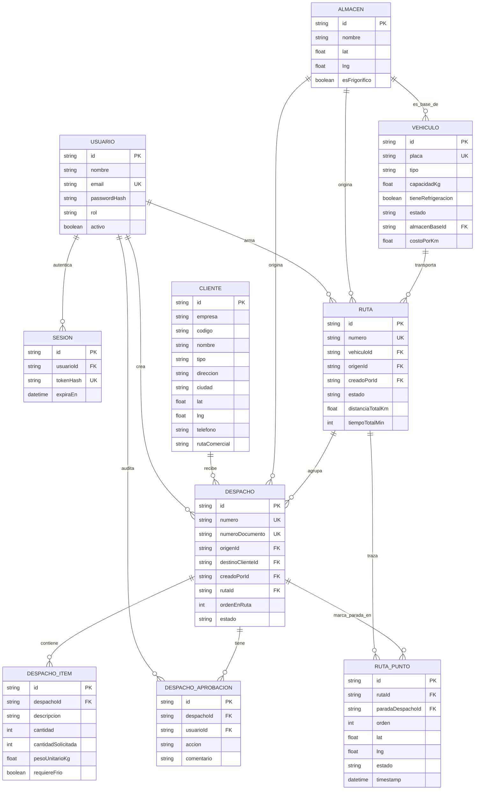

# Modelo de datos — Gestión Logística

Este documento describe el modelo de datos del sistema en términos de
negocio. La fuente de verdad técnica es
[`prisma/schema.prisma`](../prisma/schema.prisma); este archivo es su
equivalente legible, pensado para discutir el modelo sin necesidad de leer
Prisma. Ver [`docs/PLAN.md`](./PLAN.md) para la arquitectura completa.

No hay modelos de Ventas ni Inventario (`Producto`, `StockAlmacen`,
`TasaCambio`, `Factura`, `Venta`, `VentaItem`, `VentaRevision`) — se
eliminaron a propósito de esta versión (ver `docs/PLAN.md`, decisión 2).

## Diagrama entidad-relación

## Entidades

### Usuario
Personas con acceso al sistema. `rol` (`ADMIN`, `DESPACHOS`, `APROBADOR`,
`REPARTIDOR`) determina qué puede hacer cada quien — permisos aplicados
tanto en la API (`requiere_rol`) como en la UI. `passwordHash` nunca se
expone en ninguna respuesta de la API.

### Sesion
Respalda el login: una fila por sesión activa, con el hash del token (el
token crudo solo vive en la cookie httpOnly del navegador). Cerrar sesión o
expirar borra/ignora la fila — no hay JWT que revocar de otra forma.

### Almacén
Centro de acopio/distribución. Hoy la empresa opera con **un solo almacén**
(Almacén Catia, Caracas, `esFrigorifico: true`), compartido por ambas
empresas (ISVAN y TRALOG) y por toda la flota. El modelo no lo fuerza a
nivel de schema — sigue siendo una tabla de N almacenes por si se necesita
escalar.

### Vehículo
Flota propia de la empresa (no de los clientes), compartida entre ISVAN y
TRALOG. `tipo`, `capacidadKg` y `tieneRefrigeracion` alimentan la
sugerencia de vehículo al armar una Ruta (suma el peso de todos los
despachos elegidos). `costoPorKm` es opcional y solo se usa para estimar
el costo de una ruta sugerida; si está vacío se toma un valor de
referencia por tipo de vehículo (`plan_rutas.COSTO_POR_KM_POR_TIPO`).

### Cliente
Tiendas, distribuidores o consumidores finales, **de una empresa
específica**. La llave de negocio es `(empresa, codigo)` — el mismo código
puede pertenecer a un cliente distinto según sea ISVAN o TRALOG, así que
`id` es un identificador técnico aparte y `codigo` ya no es la llave
primaria por sí solo. `codigo` **siempre lo asigna el cliente/negocio**, el
sistema nunca lo genera. `lat`/`lng` son opcionales a nivel de schema, pero
**obligatorios en la práctica**: un cliente sin coordenadas no se puede
incluir en una Ruta. Unas coordenadas en **(0, 0)** valen lo mismo que un
`NULL`: ese punto cae en el golfo de Guinea, así que cuando aparece es un
dato faltante cargado como cero, no una ubicación real. El criterio vive en
un solo lugar (`backend/app/core/ubicacion.py` y su espejo
`src/lib/ubicacion.ts`) y lo aplican por igual los importadores, el armado
de rutas y el motor de sugerencia. `telefono` es obligatorio (lo usan los
despachadores para contactarlo).

`rutaComercial` es la **ruta comercial** (de venta/reparto) a la que el
negocio tiene asignado al cliente, p. ej. `"R-07"` — **no** es la `Ruta`
(viaje) de este sistema. Es opcional a nivel de schema y se puede cargar
en el Excel de clientes (columna `ruta`), pero la fuente de verdad es el
extracto de ventas: cada importación de despachos que traiga esa columna
refresca el valor del cliente. Es el criterio de mayor peso al sugerir
cómo agrupar despachos en viajes.

### Despacho
Un envío a un cliente. `numeroDocumento` es el número de factura/nota de
entrega del documento origen (Excel o carga manual) — es único y es la
llave real de agrupación/idempotencia al importar (un documento ya
importado no se puede volver a cargar). `rutaId`/`ordenEnRuta` quedan
`null` hasta que el despacho se agrega a una Ruta (solo despachos
`APROBADO` sin ruta se pueden agregar).

El flujo de `estado` en uso: `PENDIENTE_APROBACION` → (aprobación,
`DespachoAprobacion`) → `APROBADO` → (se agrega a una Ruta y esa Ruta
inicia el viaje) → `EN_TRANSITO` → (el despachador marca esa parada como
entregada) → `ENTREGADO`. `BORRADOR`, `EN_PREPARACION` y `CANCELADO` existen
en el enum pero ningún flujo actual los usa.

### DespachoItem
Línea de producto dentro de un despacho — **texto libre**, ya no referencia
un catálogo (`Producto` no existe). `descripcion`, `pesoUnitarioKg` y
`requiereFrio` vienen directo del Excel (columna directa, tamaño de
presentación en la descripción, o `litros`) o de la carga manual.
`cantidadSolicitada` se congela al crear el despacho; `cantidad` es lo que
realmente se va a despachar, ajustable por el coordinador
(`PATCH /despachos/{id}/items/{itemId}`) mientras el despacho no haya
salido del almacén.

### DespachoAprobacion
Auditoría de aprobación/rechazo de un despacho.

### Ruta
Un viaje de **un vehículo** que agrupa varios despachos (uno por cliente),
en el orden de visita que calcula **SuperMap iServer (FindTSPPaths)** a
partir de Almacén Catia — no un tramo simple origen→destino. `estado`
(`PLANIFICADA` → `EN_TRANSITO` → `COMPLETADA`, o `CANCELADA`) se maneja a
nivel de ruta completa: "Salí del almacén" pasa todos sus despachos a
`EN_TRANSITO` a la vez; la ruta pasa a `COMPLETADA` cuando se entrega la
última parada pendiente.

### Sugerencia de rutas (no es una tabla)
`POST /rutas/sugerencias` propone cómo repartir los despachos aprobados sin
ruta en viajes, sin persistir nada: agrupa por `Cliente.rutaComercial` y
cercanía, respetando capacidad y cadena de frío del vehículo, y estima km,
tiempo y costo. El usuario elige una sugerencia y la confirma con
`POST /rutas`, que es donde se calcula el trazado real. Ver
`backend/app/services/plan_rutas.py`.

### RutaPunto
Vértices de la geometría real de una Ruta (puede ser de decenas a miles de
puntos en un trayecto largo — se guarda completo, sin submuestrear, para no
cortar curvas reales de las calles). `paradaDespachoId` marca únicamente
los puntos que corresponden a la llegada a un cliente específico; el resto
de los puntos solo forma la línea del trazado (el frontend filtra cuáles
puntos marca visualmente en el mapa, ver `seguimiento-detalle-map.tsx`).

## Decisiones confirmadas

- **Ventas e Inventario no existen en este modelo** — ver `docs/PLAN.md`,
  decisión 2. Si se reintroducen en el futuro, es un módulo aparte.
- **`(empresa, codigo)` como llave de negocio del cliente**, no `codigo`
  solo — confirmado tras detectar que ISVAN y TRALOG pueden repetir el
  mismo código para clientes distintos.
- **Un solo almacén y una sola flota**, compartidos entre ambas empresas.
- **`DespachoItem` es texto libre**, sin catálogo de productos — se evaluó
  mantener un catálogo liviano para autocompletar, mismo se descartó: exige
  reconciliación (fuzzy-match) sin beneficio hasta que exista una conexión
  a la base de ventas real del cliente, que probablemente traiga sus
  propios códigos de producto.
- **`numeroDocumento` (no el código de cliente) agrupa las filas de un
  Excel en un despacho**, y debe ser único — evita reimportar el mismo
  archivo dos veces.
- **Peso por ítem sin campo dedicado en el Excel del cliente**: se deriva,
  en orden, de una columna de peso directa, del tamaño de presentación en
  la descripción del producto, o de `litros` con un factor de densidad —
  nunca se le pide al negocio un dato que no tienen a mano.
- **El vehículo se asigna a nivel de Ruta, no de Despacho** — un vehículo
  lleva varios despachos en un mismo viaje.
- **Rutas multi-parada reales vía SuperMap iServer**, no una heurística
  propia — confirmado que el servicio sí optimiza el orden de visita
  (`stopIndexes` en la respuesta), con fallback a una heurística de vecino
  más cercano si el servicio no responde.
- **La distancia entre clientes manda sobre la ruta comercial al agrupar** —
  una parada solo entra a un viaje si está dentro del radio permitido
  (`RADIO_MAX_ENTRE_PARADAS_KM`, ajustable desde la pantalla); la ruta
  comercial solo desempata entre paradas igual de cerca, como factor sobre
  la distancia. Se invirtió respecto del primer diseño, donde la ruta
  comercial pesaba primero y llegó a juntar La Guaira con Charallave.
  Quien arma la ruta puede volver la ruta comercial restricción dura con la
  casilla «No mezclar clientes de rutas comerciales distintas».
- **El costo es informativo, no condiciona la agrupación** — se estima como
  `km × costo por km del vehículo` y sirve para comparar sugerencias.
- **Sin recuperación de contraseña por correo** — un ADMIN restablece la
  contraseña de cualquier usuario directamente desde **Usuarios**.
