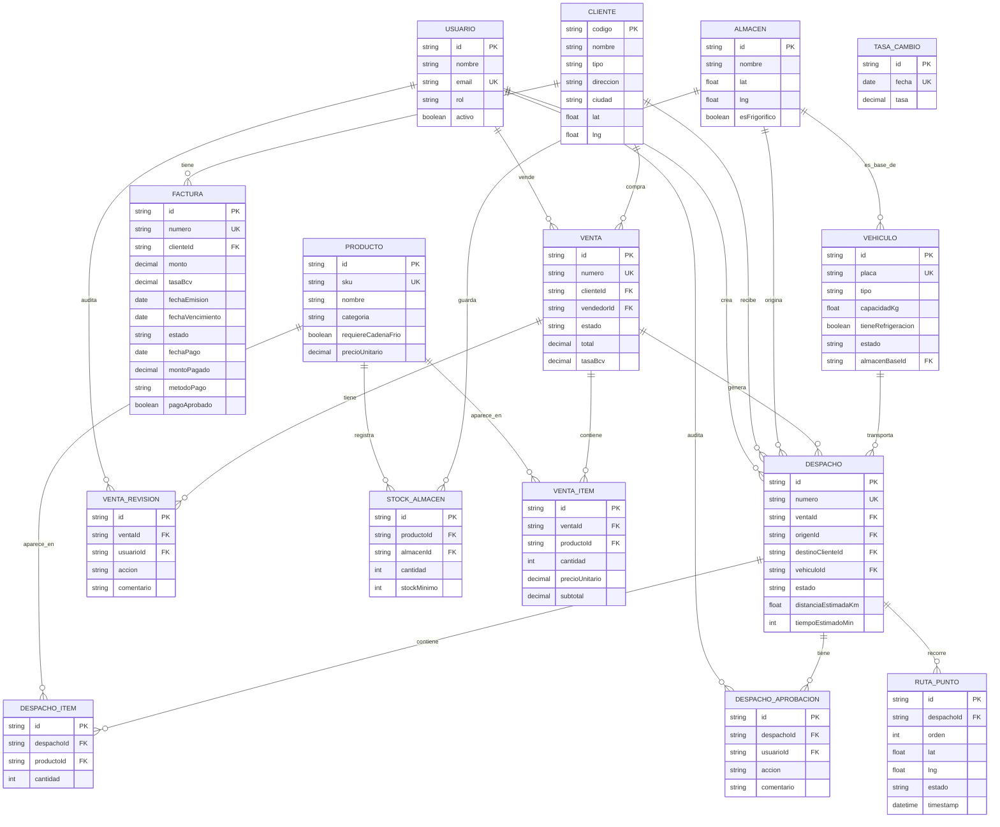

# Modelo de datos — Gestión Logística

Este documento describe el modelo de datos del sistema en términos de negocio.
La fuente de verdad técnica es [`prisma/schema.prisma`](../prisma/schema.prisma);
este archivo es su equivalente legible, pensado para discutir el modelo sin
necesidad de leer Prisma. El modelo ya está conectado a una Postgres real
(local por ahora): `prisma migrate` crea las tablas, la API FastAPI en
`backend/` las lee/escribe con `psycopg`, y el frontend consume esa API — ver
[`docs/PLAN.md`](./PLAN.md) para la arquitectura completa.

## Diagrama entidad-relación

## Entidades

### Usuario
Personas con acceso al sistema. `rol` determina qué módulos usan típicamente
(Ventas, Inventario, Despachos, Aprobador, Repartidor, Admin), aunque hoy no
hay control de permisos por rol implementado. No tiene campos de
autenticación (contraseña, sesión) — se agregan en Fase 2.

### Producto
Catálogo de helados y pizzas. `precioUnitario` está en USD — es el valor
canónico. El peso no se registra por producto individual; el algoritmo de
sugerencia de vehículo usa un promedio por categoría (decisión confirmada,
ver "Decisiones confirmadas").

### Almacén
Centro de acopio/distribución. Actualmente la empresa opera con **un solo
almacén** (Almacén Catia, Caracas), pero el modelo no lo fuerza a nivel de
schema — sigue siendo una tabla de N almacenes por si se necesita escalar.

### StockAlmacen
Cantidad de un producto en un almacén, con su mínimo para disparar el
indicador de "stock bajo". Es una tabla intermedia Producto↔Almacén.

### Cliente
Tiendas, distribuidores o consumidores finales. **El `codigo` es la llave
primaria** (no hay un id autogenerado aparte) — así lo pidió el negocio.

### TasaCambio
Histórico de la tasa oficial del BCV (Bolívares por USD), una fila por
fecha. `Venta` y `Factura` guardan su propia copia "congelada" de la tasa
vigente el día que se registraron (`tasaBcv`), para que el equivalente en Bs
de un registro pasado no cambie con la fluctuación del bolívar. El monto en
USD sigue siendo siempre el valor estable para comparar entre fechas — la UI
muestra ambas monedas juntas en todos los montos de venta/factura.

Se sincroniza sola: `backend/app/jobs/sync_tasa_bcv.py` consulta
[dolarapi.com](https://ve.dolarapi.com/v1/dolares/oficial) y hace upsert en
esta tabla todos los días a las 6:00pm (Tarea Programada de Windows), sobre
una Postgres local por ahora. Cada venta nueva usa `GET /tasa-cambio/actual`
(la fila más reciente) para su `tasaBcv`. Ver
[`backend/app/jobs/README.md`](../backend/app/jobs/README.md).

### Factura
Facturas de un cliente. `estado` (pendiente/pagada/vencida) es lo que
dispara el flujo de revisión de ventas: si el cliente tiene alguna factura
`PENDIENTE` o `VENCIDA`, su próxima venta no se aprueba automáticamente.
Los campos de pago (`fechaPago`, `montoPagado`, `metodoPago`) son
**opcionales** — no llevan un historial normalizado de abonos, solo el
último pago reportado. Lo que importa operativamente es `pagoAprobado`: si
ese pago ya fue validado por alguien o no.

### Venta
Una venta a un cliente. `estado` sigue el flujo: `PENDIENTE` (recién creada) →
si el cliente tiene deuda → `EN_REVISION` → `APROBADA`/`RECHAZADA`; si no tiene
deuda, pasa directo a `APROBADA`. Solo una venta `APROBADA` sin despacho
generado puede convertirse en un `Despacho` (ver wizard "Nuevo despacho").
`total` es siempre en USD (valor canónico para reportes); `tasaBcv` congela
la tasa del día para mostrar el Bs histórico correcto.

**Un cliente no puede tener dos ciclos de venta abiertos a la vez**:
`POST /ventas` rechaza (409) una venta nueva si el cliente ya tiene una
`Venta` `APROBADA` cuyo `Despacho` asociado (si existe) todavía no llegó a
`ENTREGADO` (ni fue `RECHAZADO`). El ciclo se cierra cuando el despachador
marca el despacho como entregado desde `/despachador` — ver "Despacho" abajo.

### VentaItem
Línea de producto dentro de una venta, con el precio "congelado" al momento de
vender (para que cambios futuros de precio no alteren ventas históricas).

### VentaRevision
Auditoría de quién aprobó/rechazó una venta que cayó en revisión por deuda del
cliente, y por qué (comentario).

### Vehículo
Flota propia de la empresa (no de los clientes). `almacenBaseId` indica dónde
tiene base — hoy siempre el único almacén. `tipo`, `capacidadKg` y
`tieneRefrigeracion` alimentan el algoritmo de sugerencia de vehículo para un
despacho.

### Despacho
Un envío. `ventaId` es opcional: la mayoría se genera desde una venta
aprobada (flujo actual del wizard "Nuevo despacho"), pero el campo permite
despachos sin venta asociada (usados en los datos de ejemplo para representar
casos históricos/manuales). Tiene su **propio** flujo de aprobación
(`EstadoDespacho` + `DespachoAprobacion`), independiente de `VentaRevision`.
`distanciaEstimadaKm`/`tiempoEstimadoMin`/`rutaCalculada` guardan el resultado
del optimizador de rutas (`POST /despachos/{id}/ruta`) — persistido de
verdad, aunque el cálculo en sí sigue siendo una síntesis mock (sin SuperMap
iServer real todavía, ver `backend/app/services/route_analysis.py`).

El flujo completo de `estado` en uso hoy es:
`PENDIENTE_APROBACION` → (aprobación) → `APROBADO` → (el despachador marca
"Salí del almacén" en `/despachador`, `POST /despachos/{id}/iniciar`, exige
`vehiculoId` asignado) → `EN_TRANSITO` → (el despachador marca "Marcar como
entregado", `POST /despachos/{id}/entregar`) → `ENTREGADO`. Un despacho es
visible en Seguimiento (`/seguimiento`) mientras esté en `APROBADO` o
`EN_TRANSITO`; deja de aparecer al llegar a `ENTREGADO`, momento en el que
también se cierra el ciclo de la `Venta` de origen (ver arriba). Los estados
`BORRADOR`, `EN_PREPARACION` y `CANCELADO` existen en el enum pero ningún
flujo actual los usa todavía.

### DespachoItem
Línea de producto dentro de un despacho (copiada de los items de la venta
cuando el despacho se genera desde una venta).

### DespachoAprobacion
Auditoría de aprobación/rechazo del despacho (independiente de la revisión de
la venta).

### RutaPunto
Waypoints (lat/lng + timestamp + estado) de la ruta de un despacho. Se usan
tanto para mostrar la "mejor ruta" calculada como para el seguimiento en vivo
en el mapa.

## Decisiones confirmadas

- **Un solo almacén** — confirmado por el negocio; el modelo lo permite pero
  no lo obliga (fácil de escalar a N almacenes después).
- **`Cliente.codigo` como llave primaria** — no hay un id técnico aparte.
- **Dos aprobaciones independientes** — la venta se revisa por deuda del
  cliente (`VentaRevision`); el despacho se aprueba por separado
  (`DespachoAprobacion`).
- **Despachos nacen de ventas aprobadas** — el wizard de creación ya no
  permite cargar productos a mano; toma cliente y productos de la venta
  seleccionada.
- **Peso de producto por promedio de categoría** — no se agrega un campo de
  peso real a `Producto`; el algoritmo de sugerencia de vehículo sigue
  aproximando por categoría (0.4 kg helado, 0.6 kg pizza). Confirmado con el
  negocio: el promedio es suficiente.
- **Tasa BCV histórica por fecha** — se agregó `TasaCambio` (fecha + tasa) y
  el campo `tasaBcv` en `Venta`/`Factura`, congelado al momento de
  registrarse. El USD sigue siendo el valor canónico para análisis (evita
  que la fluctuación del bolívar distorsione comparaciones entre fechas),
  pero **todos los montos de venta se muestran siempre en ambas monedas**.
- **Pagos de factura sin modelo normalizado** — en vez de una tabla `Pago`
  con historial de abonos, `Factura` tiene campos de pago opcionales
  (`fechaPago`, `montoPagado`, `metodoPago`) para el último pago reportado,
  más un flag `pagoAprobado` — que es lo que realmente importa
  operativamente (si ese pago ya fue validado o no).
- **Sin devoluciones/notas de crédito** — no es una funcionalidad necesaria
  por ahora; se puede agregar más adelante si surge la necesidad.
